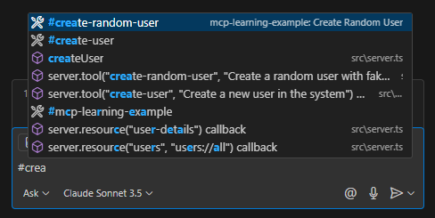

# Model Context Protocol (MCP) Learning Notes

## Video Reference
- **Source**: [Web Dev Simplified YouTube Video](https://youtu.be/ZoZxQwp1PiM?si=F2Wb-wrBPOkBmKkz)
- **Credits**: Web Dev Simplified (YouTube channel)

## What is MCP?
Model Context Protocol (MCP) is a protocol that defines how a client (such as an LLM) can communicate and use tools and resources defined at the server level. It implements a client-server architecture with the following components:
- Tools
- Resources
- Prompts
- Samplings

## Documentation & Resources
- Official documentation: [modelcontextprotocol.io/introduction](https://modelcontextprotocol.io/introduction)
- Includes starter projects in multiple languages for MCP client and server implementation

## Implementation Details

### Server Setup
The `src/server.ts` file contains the code for creating an MCP server and defining tools, resources, and prompts.

### Testing the Implementation
1. Build the server:
   ```bash
   npm run server:build
   ```
2. Add to VS Code using the "Add MCP server" command
3. Access server functionality in the Copilot chat UI
4. Use "#" followed by tool name to access implemented tools



### Implemented Features

#### Resources
- **users**: Retrieves all users from the JSON file
- **user-details**: Retrieves user details by ID

#### Tools
- **create-user**: Creates a new user with the following parameters:
  - username
  - email
  - address
  - age
  - phone number
- **create-random-user**: Generates and creates a random user

#### Prompts
- **generate-fake-user**: Prompt with fixed fields for generating fake user data