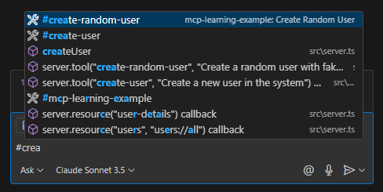

# Model Context Protocol (MCP) Learning Notes

## Video Reference
- **Source**: [Web Dev Simplified YouTube Video](https://youtu.be/ZoZxQwp1PiM?si=F2Wb-wrBPOkBmKkz)
- **Credits**: Web Dev Simplified (YouTube channel)

## What is MCP?
Model Context Protocol (MCP) is a protocol that defines how a client (such as an LLM) can communicate and use tools and resources defined at the server level. It implements a client-server architecture with the following components:
- Tools
- Resources
- Prompts
- Samplings

## Documentation & Resources
- Official documentation: [modelcontextprotocol.io/introduction](https://modelcontextprotocol.io/introduction)
- Includes starter projects in multiple languages for MCP client and server implementation

## Implementation Details

### Server Setup
The `src/server.ts` file contains the code for creating an MCP server and defining tools, resources, and prompts.

### Testing the Implementation
1. Build the server:
   ```bash
   npm run server:build
   ```
2. Add to VS Code using the "Add MCP server" command
3. Access server functionality in the Copilot chat UI
4. Use "#" followed by tool name to access implemented tools




### Client Implementation

Note: to use the query and prompts from the client you will need a gemini ai api key, you can add this in the .env file

The `src/client.ts` file provides a CLI client for interacting with the MCP server. It connects to the server, lists available tools, resources, and prompts, and allows you to:

- Query the LLM directly
- Run tools (with parameter input)
- Access resources (with dynamic URI parameters)
- Use prompts (with argument input)

#### How it works

1. Connects to the MCP server using a transport layer.
2. Fetches available tools, resources, prompts, and resource templates.
3. Presents a menu for the user to select an action: Query, Tools, Resources, or Prompts.
4. Handles each action:
   - **Query**: Sends a prompt to the LLM and optionally invokes tools.
   - **Tools**: Lets you select and run a tool, entering parameters as needed.
   - **Resources**: Lets you select a resource or template, entering URI parameters if required, and displays the result.
   - **Prompts**: Lets you select a prompt, enter arguments, and view the generated output.
5. For prompts, you can choose to run the generated text through the LLM for further results.

#### Example Usage

When you run the client, you'll see a menu:

```
What would you like to do
❯ Query
  Tools
  Resources
  Prompts
```

Selecting an option will guide you through the available features interactively.


#### Resources
- **users**: Retrieves all users from the JSON file
- **user-details**: Retrieves user details by ID

#### Tools
- **create-user**: Creates a new user with the following parameters:
  - username
  - email
  - address
  - age
  - phone number
- **create-random-user**: Generates and creates a random user

#### Prompts
- **generate-fake-user**: Prompt with fixed fields for generating fake user data

#### Sampling
- **create-random-user**: This uses sampling i.e. calling requests on the LLM or clientto generate something.

